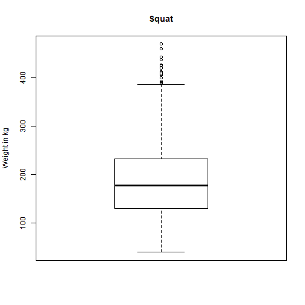

## Introduction

The purpose  of this project is:

1. To produce a reproducible pitch using Slidify or Rstudio Presenter, which is this document that you are reading. Located at: <https://bitinsky.github.io/Developing_Data_Products/week4_shiny_assignment/week4.html>
2. To demonstrate a Shiny application that is deployed to Rstudio's servers, which is located at: <https://bitinsky.shinyapps.io/IPF_statistics/>.

All source code may be found at: <https://github.com/bitinsky/Developing_Data_Products/tree/gh-pages/week4_shiny_assignment/>

## International Powerlifting Federation Statistics
This application demonstrates the powerlifting statistics across the three events (Squat, Bench Press, and Deadlift) and the Total of all three events.

It does this by producing a boxplot, by event and gender - which may be selected by the user. This way a user may compare their best lifts to a database of all other powerlfiters.

The following example boxplot shows the median weight (the line) squatted for all lifters in the IPF, the interquartile range (the box) and all of the outliers.

## Example BoxPlot


```r
data <- read.csv("shiny/data/openpowerlifting.csv")
boxplot(data$Best3SquatKg, main = "Squat", ylab = "Weight in kg")
```




## The Dataset


```r
str(data)
```

```
## 'data.frame':	5505 obs. of  10 variables:
##  $ Sex            : Factor w/ 2 levels "F","M": 2 2 2 2 2 2 1 1 1 1 ...
##  $ Event          : Factor w/ 1 level "SBD": 1 1 1 1 1 1 1 1 1 1 ...
##  $ Equipment      : Factor w/ 1 level "Raw": 1 1 1 1 1 1 1 1 1 1 ...
##  $ Age            : num  23.5 21.5 22.5 19.5 18.5 20.5 48.5 26.5 37.5 23.5 ...
##  $ WeightClassKg  : Factor w/ 22 levels "105","110","110+",..: 8 8 8 8 8 8 8 11 11 14 ...
##  $ Best3SquatKg   : num  250 252 270 218 190 ...
##  $ Best3BenchKg   : num  172 172 178 155 135 ...
##  $ Best3DeadliftKg: num  145 142 130 125 120 ...
##  $ TotalKg        : num  568 568 578 498 445 ...
##  $ Federation     : Factor w/ 1 level "IPF": 1 1 1 1 1 1 1 1 1 1 ...
```

## Limitations and References
Currently the project only shows data for lifters competing within the International Powerlifting Federation. 

There are currently several outliers because the data is not broken up into the various classes. Future versions of this will include all federations, age, and weight classes.

The data used is a subset what is available which was created simply to improve performance of this prototype. Again, future versions of the application will allow for the entire dataset.

All data is courtesy of <https://www.openpowerlifting.org/> 
